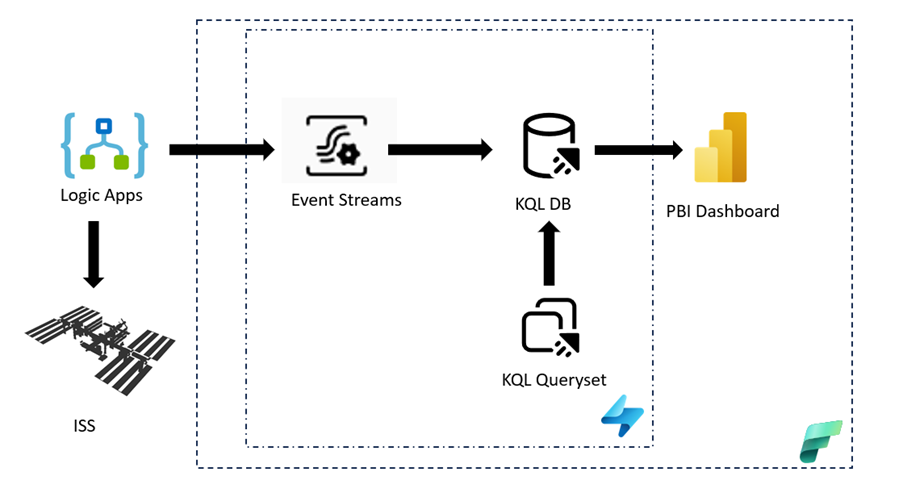
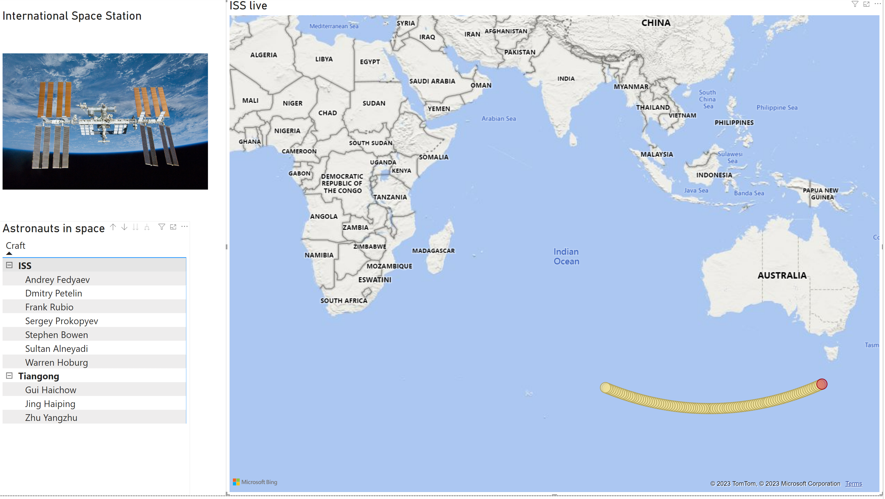
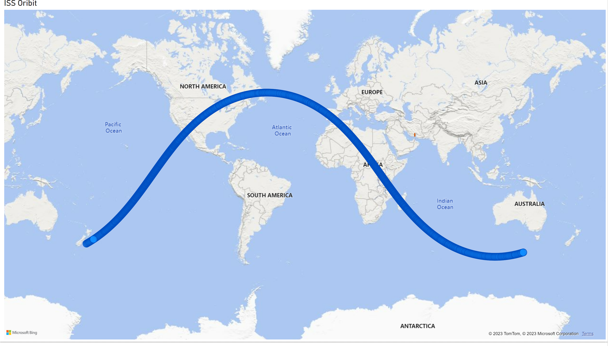

<p align="center">
  
</p>

<h1 align="center">🛰️ ISS Tracker Demo — Tales From the Field 🚀</h1>

<p align="center">
  <em>Helping you solve real-world problems with insights from the field</em>
</p>

<p align="center">
  <!-- CI/CD badges — update URLs once workflows are configured -->
  
  
  
  
</p>

---

## Deploy To Azure

<p align="center">
  <a href="https://portal.azure.com/#create/Microsoft.Template/uri/https%3A%2F%2Fraw.githubusercontent.com%2FTalesFromTheField%2Fiss-demo%2Fmain%2Finfra%2Fazuredeploy.json">
    
  </a>
</p>

The button provisions Azure infrastructure from `infra/main.bicep` (Event Hubs, Function App, monitoring, RBAC).

After the template deployment finishes, deploy the Function App code and complete Fabric + Power BI setup using the
[Deployment Guide](docs/deployment-guide.md).

---

## 📺 Video Walkthrough

Check out the full walkthrough on YouTube! 🎬

<p align="center">
  <a href="https://www.youtube.com/watch?v=iWepPEUUO_4">
    
  </a>
</p>

---

## 🚀 What Is This?

Ever wondered where the International Space Station is *right now*? 🌍

This demo tracks the **ISS in real-time** — pulling its live position every few seconds, streaming the data through Azure and Microsoft Fabric, and lighting it up on a Power BI dashboard. You get a live map of the station orbiting Earth plus details on which astronauts are currently floating around up there! 🧑‍🚀✨

It's a fun, end-to-end showcase of **real-time data streaming** from the cloud to your dashboard — built with love by the Tales From the Field crew.

---

## 🏗️ Architecture

The ISS Tracker uses **Azure Functions** (Python v2) to poll the Open Notify API on a timer, push events into **Event Hubs**, and stream them through **Microsoft Fabric** into a **KQL Database** for real-time analysis and **Power BI** visualization.

<p align="center">
  
</p>

**Data Flow:**

```
🌐 Open Notify API  →  ⚡ Azure Functions (timer-triggered)
                              ↓
                        📡 Azure Event Hubs
                              ↓
                        🌊 Fabric EventStreams
                              ↓
                        🗄️ KQL Database
                              ↓
                        📊 Power BI Dashboard
```

---

## ⚡ Quick Start

Ready to deploy? Here's how to get rolling:

1. **☁️ Deploy Azure Infrastructure** — Follow the [Deployment Guide](docs/deployment-guide.md) to provision Azure Functions, Event Hubs, monitoring, and RBAC via Bicep + GitHub Actions.
2. **🧵 Set Up Microsoft Fabric** — Follow the [Fabric Setup Guide](docs/fabric-setup.md) to configure EventStreams, KQL Database, and Power BI.
3. **🎉 Watch the ISS fly!** — Open your Power BI dashboard and see the station orbit in real-time.

---

## 🔧 What's Automated vs Manual

| Component | Status | Details |
|---|---|---|
| Azure Functions | ✅ Automated | Deployed via Bicep + GitHub Actions CI/CD |
| Event Hubs | ✅ Automated | Provisioned via Bicep modules |
| Monitoring & Alerts | ✅ Automated | Application Insights + Log Analytics via Bicep |
| RBAC & Permissions | ✅ Automated | Role assignments configured in Bicep |
| Fabric EventStreams | 🖱️ Manual (~5 min) | Connect Event Hubs to Fabric via portal |
| KQL Database | 🖱️ Manual (~5 min) | Create database & set as EventStream destination |
| Power BI Dashboard | 🖱️ Manual (~5 min) | Import `.pbix` file and configure connection |

> 💡 **Total manual setup time: ~15 minutes** after the automated deployment completes!

---

## 📊 Screenshots

Check out what the finished dashboard looks like! 🎨

**🌍 Live ISS Position:**

<p align="center">
  
</p>

**🛰️ ISS Orbital Path:**

<p align="center">
  
</p>

---

## 🛠️ Tech Stack

| | Technology | What It Does |
|---|---|---|
| 🐍 | **Python 3.11** | Azure Functions runtime language |
| ⚡ | **Azure Functions (v2)** | Timer-triggered ISS data poller |
| 📡 | **Azure Event Hubs** | Real-time event ingestion |
| 🏗️ | **Bicep** | Infrastructure-as-Code for Azure resources |
| 🔄 | **GitHub Actions** | CI/CD pipeline for automated deployments |
| 🧵 | **Microsoft Fabric** | EventStreams + Real-Time Intelligence |
| 🔍 | **KQL (Kusto Query Language)** | Ad-hoc data exploration and analysis |
| 📊 | **Power BI** | Real-time dashboards and visualization |

---

## 📁 Project Structure

```
iss-demo/
├── 📂 functions/              # Azure Functions (Python v2)
│   ├── function_app.py        #   Timer-triggered ISS poller
│   ├── requirements.txt       #   Python dependencies
│   ├── host.json              #   Functions host config
│   └── tests/                 #   Unit & integration tests (pytest)
├── 📂 infra/                  # Infrastructure-as-Code
│   ├── main.bicep             #   Orchestrator — wires all modules
│   ├── modules/
│   │   ├── event-hubs.bicep   #   Event Hubs namespace + hubs
│   │   ├── function-app.bicep #   Storage, Plan, Function App + MI
│   │   ├── monitoring.bicep   #   App Insights + Log Analytics
│   │   └── role-assignments.bicep # RBAC: MI → Event Hubs Data Sender
│   └── parameters/
│       └── dev.bicepparam     #   Dev environment parameters
├── 📂 scripts/                # Automation scripts
│   └── deploy-fabric.sh       #   Fabric CLI resource provisioning
├── 📂 kql/                    # Kusto queries
│   └── ISS.kql                #   Ad-hoc ISS data analysis
├── 📂 PBI/                    # Power BI
│   └── ISS.pbix               #   Dashboard template
├── 📂 logicapps/              # Legacy Logic Apps flows (reference)
├── 📂 docs/                   # Documentation
├── 📂 images/                 # Diagrams, screenshots, logos
├── 📂 .github/                # GitHub Actions CI/CD workflows
├── CHANGELOG.md               # Release history
└── README.md                  # 👈 You are here!
```

---

## 👥 Team

Built with 💙 by the **Tales From the Field** crew — a bunch of field engineers who love turning real-world challenges into fun demos!

| Name | GitHub |
|---|---|
| 🎱 Bradley Ball | [@SQLBalls](https://github.com/SQLBalls) |
| 🚀 Josh Luedeman | [@joshluedeman](https://github.com/joshluedeman) |
| ⚡ Neeraj Jhaveri | |
| 🐕 Daniel Taylor | [@DBABulldog](https://github.com/DBABulldog) |
| 🧰 Brad Schacht | |

---

## ⚖️ Disclaimer

> We all work for Microsoft, but this channel is not affiliated with Microsoft and any opinions expressed are ours alone.

---

<p align="center">
  Made with ☕ and 🚀 by <strong>Tales From the Field</strong>
</p>
